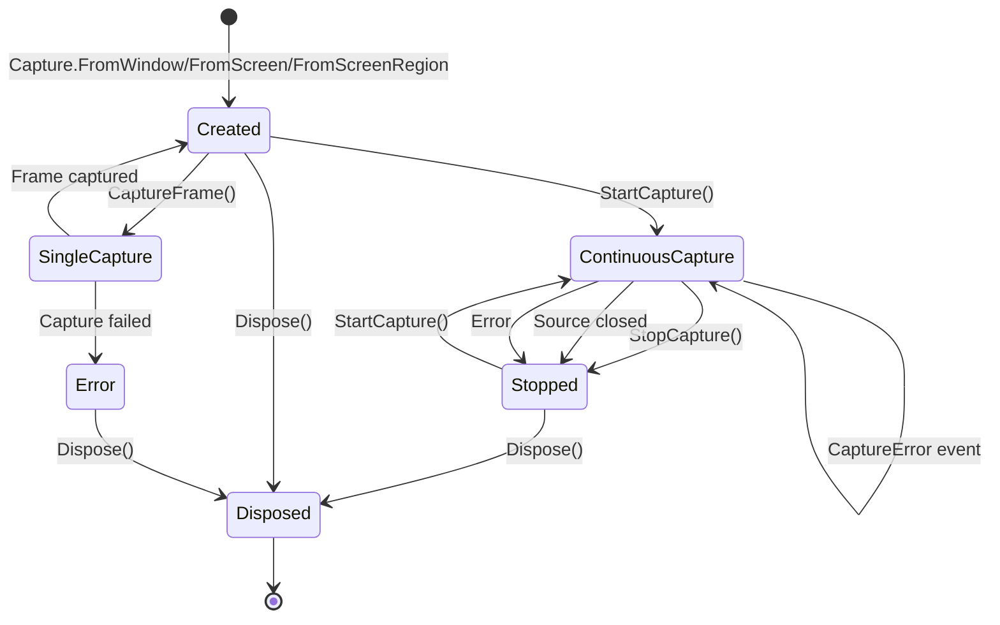

# WindowCaptureCL - Library Reference

> **Спецификация для интеграции с библиотеками серии: SendSequence, WindowManager, ImageSearch**

**Версия документа:** 1.0.0  
**Версия библиотеки:** 1.0.0  
**Дата:** 2025-01-30  
**Статус:** Активная спецификация

---

## 1. Краткое описание библиотеки

### 1.1 Назначение и основные возможности

**WindowCaptureCL** — это высокопроизводительная .NET библиотека для захвата скриншотов окон, мониторов и регионов экрана с использованием Windows Graphics Capture API (WGC).

**Основные возможности:**

| Возможность | Описание |
|-------------|----------|
| **Захват окон** | Захват отдельных окон по handle (HWND) |
| **Захват мониторов** | Захват полного экрана по индексу монитора |
| **Захват регионов** | Захват произвольных прямоугольных областей |
| **Однокадровый режим** | Синхронный и асинхронный захват одного кадра |
| **Непрерывный режим** | Потоковая передача кадров с контролем FPS (1-120) |
| **Аппаратное ускорение** | Использование DirectX 11 для GPU-ускоренного захвата |
| **Захват скрытых окон** | Возможность захвата окон, перекрытых другими |

### 1.2 Целевая аудитория и сценарии использования

**Целевая аудитория:**
- Разработчики автоматизации UI (UI Automation)
- Создатели инструментов для тестирования
- Разработчики систем мониторинга и записи экрана
- Интеграторы библиотек серии CL (Capture Library)

**Сценарии использования:**

```
┌─────────────────────────────────────────────────────────────────┐
│                    Сценарии использования                        │
├─────────────────────────────────────────────────────────────────┤
│                                                                 │
│  ┌──────────────┐    ┌──────────────┐    ┌──────────────┐      │
│  │  Автоматизация│    │  Мониторинг  │    │  Тестирование │      │
│  │  UI-тестов   │    │  приложений  │    │  визуальной   │      │
│  │              │    │              │    │  регрессии    │      │
│  └──────┬───────┘    └──────┬───────┘    └──────┬───────┘      │
│         │                   │                   │              │
│         └───────────────────┼───────────────────┘              │
│                             ▼                                  │
│                    ┌─────────────────┐                         │
│                    │  WindowCaptureCL │                         │
│                    │   [Захват кадров]│                         │
│                    └────────┬────────┘                         │
│                             │                                  │
│         ┌───────────────────┼───────────────────┐              │
│         ▼                   ▼                   ▼              │
│  ┌──────────────┐    ┌──────────────┐    ┌──────────────┐      │
│  │ ImageSearch  │    │ SendSequence │    │WindowManager │      │
│  │ [Анализ]     │    │ [Действия]   │    │ [Управление] │      │
│  └──────────────┘    └──────────────┘    └──────────────┘      │
│                                                                 │
└─────────────────────────────────────────────────────────────────┘
```

### 1.3 Ключевые особенности и ограничения

**Ключевые особенности:**

| Особенность | Значение |
|-------------|----------|
| **API** | Windows Graphics Capture API |
| **Минимальная ОС** | Windows 10 версии 1803 (April 2018 Update) |
| **Целевой Framework** | .NET 8.0-windows10.0.19041.0 |
| **Графика** | DirectX 11 |
| **Формат пикселей** | B8G8R8A8 (32-bit BGRA) |
| **Выходной формат** | System.Drawing.Bitmap |
| **Максимальный FPS** | 120 |
| **Минимальный FPS** | 1 |

**Ограничения:**

- ❌ Не работает в сессиях Remote Desktop (RDP)
- ❌ Не работает в некоторых виртуальных машинах без 3D-ускорения
- ❌ Не захватывает DRM-защищенный контент
- ❌ Требует видимого окна (нельзя захватить свернутое окно)
- ❌ Требует Windows 10 1803+ (не работает на Windows 7/8)
- ❌ Окно должно быть в текущей пользовательской сессии

---

## 2. Публичное API (полная спецификация)

### 2.1 Пространства имен

```csharp
namespace WindowCaptureCL                    // Основное API
namespace WindowCaptureCL.Infrastructure.WGC // Утилиты перечисления
```

### 2.2 Статический фасад: Capture

Главная точка входа для создания сессий захвата.

```csharp
public static class Capture
{
    // Захват окна по handle
    public static ICaptureSession FromWindow(IntPtr windowHandle)
    
    // Захват монитора по индексу
    public static ICaptureSession FromScreen(int monitorIndex)
    
    // Захват региона на мониторе
    public static ICaptureSession FromScreenRegion(int monitorIndex, Rectangle region)
}
```

#### Методы

##### `FromWindow(IntPtr windowHandle)`

Создает сессию захвата для указанного окна.

| Параметр | Тип | Описание |
|----------|-----|----------|
| `windowHandle` | `IntPtr` | Handle окна (HWND) для захвата |

**Возвращает:** `ICaptureSession` — сессия захвата окна

**Исключения:**

| Исключение | Условие |
|------------|---------|
| `ArgumentException` | `windowHandle` равен `IntPtr.Zero` |
| `WindowNotFoundException` | Окно не найдено или недействительно |
| `GraphicsCaptureNotSupportedException` | WGC не поддерживается системой |

**Пример:**
```csharp
IntPtr hwnd = FindWindow(null, "Calculator");
using var session = Capture.FromWindow(hwnd);
var frame = session.CaptureFrame();
```

---

##### `FromScreen(int monitorIndex)`

Создает сессию захвата для монитора.

| Параметр | Тип | Описание |
|----------|-----|----------|
| `monitorIndex` | `int` | Индекс монитора (0 = основной) |

**Возвращает:** `ICaptureSession` — сессия захвата монитора

**Исключения:**

| Исключение | Условие |
|------------|---------|
| `ArgumentOutOfRangeException` | `monitorIndex` отрицательный |
| `InvalidMonitorException` | Индекс вне диапазона доступных мониторов |
| `GraphicsCaptureNotSupportedException` | WGC не поддерживается системой |

**Пример:**
```csharp
// Захват основного монитора
using var session = Capture.FromScreen(0);
var frame = session.CaptureFrame();
```

---

##### `FromScreenRegion(int monitorIndex, Rectangle region)`

Создает сессию захвата для региона на мониторе.

| Параметр | Тип | Описание |
|----------|-----|----------|
| `monitorIndex` | `int` | Индекс монитора |
| `region` | `Rectangle` | Прямоугольная область относительно монитора |

**Возвращает:** `ICaptureSession` — сессия захвата региона

**Исключения:**

| Исключение | Условие |
|------------|---------|
| `ArgumentOutOfRangeException` | `monitorIndex` отрицательный |
| `ArgumentException` | `region` имеет нулевые или отрицательные размеры |
| `InvalidMonitorException` | Индекс вне диапазона |
| `RegionOutOfBoundsException` | Регион выходит за границы монитора |
| `GraphicsCaptureNotSupportedException` | WGC не поддерживается системой |

**Пример:**
```csharp
var region = new Rectangle(100, 100, 800, 600);
using var session = Capture.FromScreenRegion(0, region);
var frame = session.CaptureFrame();
```

---

### 2.3 Интерфейс: ICaptureSession

Представляет активную сессию захвата. Реализует `IDisposable`.

```csharp
public interface ICaptureSession : IDisposable
{
    // Свойства
    CaptureSourceInfo SourceInfo { get; }
    bool IsActive { get; }
    CaptureConfiguration Configuration { get; }
    ulong TotalFramesCaptured { get; }
    
    // События
    event EventHandler<FrameReadyEventArgs>? FrameReady;
    event EventHandler<CaptureErrorEventArgs>? CaptureError;
    event EventHandler<CaptureStoppedEventArgs>? CaptureStopped;
    
    // Методы
    void StartCapture();
    void StopCapture();
    CapturedFrame CaptureFrame();
    Task<CapturedFrame> CaptureFrameAsync(CancellationToken cancellationToken = default);
    void UpdateConfiguration(CaptureConfiguration configuration);
}
```

#### Свойства

| Свойство | Тип | Описание |
|----------|-----|----------|
| `SourceInfo` | `CaptureSourceInfo` | Информация об источнике захвата |
| `IsActive` | `bool` | Активна ли сессия (непрерывный захват) |
| `Configuration` | `CaptureConfiguration` | Текущая конфигурация сессии |
| `TotalFramesCaptured` | `ulong` | Общее количество захваченных кадров |

#### События

##### `FrameReady`

```csharp
event EventHandler<FrameReadyEventArgs>? FrameReady
```

Возникает при готовности нового кадра в режиме непрерывного захвата.

**Параметры события:**

| Свойство | Тип | Описание |
|----------|-----|----------|
| `Frame` | `Bitmap` | Захваченный кадр |
| `Timestamp` | `DateTime` | Время захвата |
| `FrameNumber` | `ulong` | Порядковый номер кадра |

**Важно:** Подписываться на событие необходимо ДО вызова `StartCapture()`.

---

##### `CaptureError`

```csharp
event EventHandler<CaptureErrorEventArgs>? CaptureError
```

Возникает при ошибке во время захвата.

**Параметры события:**

| Свойство | Тип | Описание |
|----------|-----|----------|
| `Exception` | `Exception` | Исключение, вызвавшее ошибку |
| `Timestamp` | `DateTime` | Время ошибки |
| `CanContinue` | `bool` | Может ли сессия продолжить работу |

---

##### `CaptureStopped`

```csharp
event EventHandler<CaptureStoppedEventArgs>? CaptureStopped
```

Возникает при остановке сессии захвата.

**Параметры события:**

| Свойство | Тип | Описание |
|----------|-----|----------|
| `Reason` | `CaptureStopReason` | Причина остановки |
| `Exception` | `Exception?` | Исключение (если причина = Error) |

**Значения `CaptureStopReason`:**

| Значение | Описание |
|----------|----------|
| `UserRequested` | Остановка по запросу пользователя (`StopCapture()`) |
| `SourceClosed` | Источник (окно/монитор) был закрыт или стал недействительным |
| `Error` | Остановка из-за ошибки |

---

#### Методы

##### `StartCapture()`

```csharp
void StartCapture()
```

Запускает непрерывный захват кадров. Кадры будут доставляться через событие `FrameReady`.

**Исключения:**

| Исключение | Условие |
|------------|---------|
| `InvalidCaptureStateException` | Сессия уже активна |
| `ObjectDisposedException` | Сессия была освобождена |
| `SessionAlreadyStartedException` | Сессия уже запущена |

---

##### `StopCapture()`

```csharp
void StopCapture()
```

Останавливает непрерывный захват кадров.

**Исключения:**

| Исключение | Условие |
|------------|---------|
| `InvalidCaptureStateException` | Сессия не активна |
| `ObjectDisposedException` | Сессия была освобождена |
| `SessionNotStartedException` | Сессия не была запущена |

---

##### `CaptureFrame()`

```csharp
CapturedFrame CaptureFrame()
```

Захватывает один кадр синхронно.

**Возвращает:** `CapturedFrame` — захваченный кадр

**Исключения:**

| Исключение | Условие |
|------------|---------|
| `FrameCaptureException` | Ошибка захвата кадра |
| `ObjectDisposedException` | Сессия была освобождена |

---

##### `CaptureFrameAsync(CancellationToken)`

```csharp
Task<CapturedFrame> CaptureFrameAsync(CancellationToken cancellationToken = default)
```

Захватывает один кадр асинхронно.

| Параметр | Тип | Описание |
|----------|-----|----------|
| `cancellationToken` | `CancellationToken` | Токен отмены операции |

**Возвращает:** `Task<CapturedFrame>` — задача с захваченным кадром

**Исключения:**

| Исключение | Условие |
|------------|---------|
| `FrameCaptureException` | Ошибка захвата кадра |
| `ObjectDisposedException` | Сессия была освобождена |
| `OperationCanceledException` | Операция отменена |

---

##### `UpdateConfiguration(CaptureConfiguration)`

```csharp
void UpdateConfiguration(CaptureConfiguration configuration)
```

Обновляет конфигурацию сессии. Изменения вступают в силу немедленно.

| Параметр | Тип | Описание |
|----------|-----|----------|
| `configuration` | `CaptureConfiguration` | Новая конфигурация |

**Исключения:**

| Исключение | Условие |
|------------|---------|
| `ArgumentNullException` | `configuration` равен null |
| `InvalidConfigurationException` | Конфигурация недействительна |
| `ObjectDisposedException` | Сессия была освобождена |

---

### 2.4 Класс: CaptureConfiguration

Конфигурация сессии захвата. Поддерживает глобальные настройки по умолчанию и индивидуальные настройки сессии.

```csharp
public sealed class CaptureConfiguration
{
    // Статические свойства (глобальные настройки по умолчанию)
    public static bool IncludeCursor { get; set; }
    public static bool DrawBorder { get; set; }
    public static int DefaultTargetFPS { get; set; }
    
    // Константы
    public const int MinimumFPS = 1;
    public const int MaximumFPS = 120;
    
    // Свойства экземпляра
    public int MaxFramesPerSecond { get; set; }
    
    // Методы
    public CaptureConfiguration Clone()
}
```

#### Статические свойства (глобальные настройки)

| Свойство | Тип | По умолчанию | Описание |
|----------|-----|--------------|----------|
| `IncludeCursor` | `bool` | `false` | Включать ли курсор в захват |
| `DrawBorder` | `bool` | `false` | Рисовать ли рамку вокруг захваченных окон |
| `DefaultTargetFPS` | `int` | `30` | Целевой FPS по умолчанию для новых сессий |

**Примечание:** Статические свойства потокобезопасны (используют блокировки).

#### Свойства экземпляра

| Свойство | Тип | По умолчанию | Описание |
|----------|-----|--------------|----------|
| `MaxFramesPerSecond` | `int` | `30` | Максимальный FPS для непрерывного захвата (1-120) |

---

### 2.5 Класс: CapturedFrame

Представляет один захваченный кадр с метаданными. Реализует `IDisposable`.

```csharp
public sealed class CapturedFrame : IDisposable
{
    // Свойства
    public Bitmap Bitmap { get; }
    public DateTime Timestamp { get; }
    public int Width { get; }
    public int Height { get; }
    
    // Методы
    public void Save(string filePath)
    public void Save(string filePath, ImageFormat format)
    public void Dispose()
}
```

#### Свойства

| Свойство | Тип | Описание |
|----------|-----|----------|
| `Bitmap` | `Bitmap` | Данные изображения кадра |
| `Timestamp` | `DateTime` | Время захвата кадра |
| `Width` | `int` | Ширина кадра в пикселях |
| `Height` | `int` | Высота кадра в пикселях |

#### Методы

##### `Save(string filePath)`

Сохраняет кадр в файл. Формат определяется расширением файла.

| Параметр | Тип | Описание |
|----------|-----|----------|
| `filePath` | `string` | Путь для сохранения |

**Исключения:**

| Исключение | Условие |
|------------|---------|
| `ArgumentNullException` | `filePath` равен null |
| `ObjectDisposedException` | Кадр был освобожден |

##### `Save(string filePath, ImageFormat format)`

Сохраняет кадр с указанным форматом.

| Параметр | Тип | Описание |
|----------|-----|----------|
| `filePath` | `string` | Путь для сохранения |
| `format` | `ImageFormat` | Формат изображения |

---

### 2.6 Класс: CaptureSourceInfo

Информация об источнике захвата.

```csharp
public sealed class CaptureSourceInfo
{
    // Свойства
    public object Id { get; }
    public CaptureSourceType SourceType { get; }
    public string DisplayName { get; }
    public int Width { get; }
    public int Height { get; }
    public IntPtr WindowHandle { get; }
    public int MonitorIndex { get; }
    public Rectangle Region { get; }
}
```

#### Свойства

| Свойство | Тип | Описание |
|----------|-----|----------|
| `Id` | `object` | Уникальный идентификатор источника |
| `SourceType` | `CaptureSourceType` | Тип источника |
| `DisplayName` | `string` | Отображаемое имя |
| `Width` | `int` | Ширина в пикселях |
| `Height` | `int` | Высота в пикселях |
| `WindowHandle` | `IntPtr` | Handle окна (для Window) или `IntPtr.Zero` |
| `MonitorIndex` | `int` | Индекс монитора (для Monitor/Region) или -1 |
| `Region` | `Rectangle` | Регион (для Region) или `Rectangle.Empty` |

**Тип Id в зависимости от SourceType:**

| SourceType | Тип Id | Значение |
|------------|--------|----------|
| `Window` | `IntPtr` | HWND окна |
| `Monitor` | `int` | Индекс монитора |
| `Region` | `(int, Rectangle)` | Кортеж (monitorIndex, region) |

---

### 2.7 Перечисления

#### CaptureSourceType

```csharp
public enum CaptureSourceType
{
    Window = 0,   // Окно
    Monitor = 1,  // Монитор
    Region = 2    // Регион на мониторе
}
```

#### CaptureStopReason

```csharp
public enum CaptureStopReason
{
    UserRequested = 0,  // По запросу пользователя
    SourceClosed = 1,   // Источник закрыт
    Error = 2           // Ошибка
}
```

---

### 2.8 Утилиты перечисления

#### WindowEnumerator

```csharp
public static class WindowEnumerator
{
    public static WindowInfo? FindWindow(IntPtr hwnd)
    public static WindowInfo? FindWindowByProcessId(int processId)
    public static WindowInfo? FindWindowByTitle(string title)
    public static List<WindowInfo> FindWindowsByPartialTitle(string partialTitle)
}
```

**WindowInfo:**

```csharp
public sealed class WindowInfo
{
    public IntPtr Handle { get; }    // HWND
    public string Title { get; }
    public int Width { get; }
    public int Height { get; }
}
```

#### MonitorEnumerator

```csharp
public static class MonitorEnumerator
{
    public static List<MonitorInfo> GetAllMonitors()
    public static MonitorInfo? GetPrimaryMonitor()
    public static MonitorInfo? GetMonitorByIndex(int index)
    public static MonitorInfo? GetMonitorByDeviceName(string deviceName)
}
```

**MonitorInfo:**

```csharp
public sealed class MonitorInfo
{
    public IntPtr Handle { get; }      // HMONITOR
    public string DeviceName { get; }  // \\.\DISPLAY1
    public int Width { get; }
    public int Height { get; }
    public bool IsPrimary { get; }
}
```

---

### 2.9 Иерархия исключений

```
System.Exception
└── CaptureException (abstract)
    ├── GraphicsCaptureNotSupportedException
    ├── CaptureSourceNotFoundException
    │   └── CaptureTargetInvalidException (abstract)
    │       ├── WindowNotFoundException
    │       └── InvalidMonitorException
    ├── InvalidCaptureStateException
    ├── FrameCaptureException
    ├── InvalidConfigurationException
    ├── DirectXException
    ├── ResourceAllocationException
    ├── UnsupportedOperationException
    ├── GraphicsDeviceException
    ├── RegionOutOfBoundsException
    ├── SessionAlreadyStartedException
    └── SessionNotStartedException
```

#### Основные исключения

| Исключение | Описание | Свойства |
|------------|----------|----------|
| `GraphicsCaptureNotSupportedException` | WGC не поддерживается | — |
| `WindowNotFoundException` | Окно не найдено | `WindowHandle` |
| `InvalidMonitorException` | Неверный индекс монитора | `MonitorIndex` |
| `RegionOutOfBoundsException` | Регион выходит за границы | `AttemptedRegion`, `MonitorSize` |
| `InvalidCaptureStateException` | Неверное состояние сессии | `CurrentState` |
| `FrameCaptureException` | Ошибка захвата кадра | — |
| `InvalidConfigurationException` | Неверная конфигурация | `PropertyName` |
| `DirectXException` | Ошибка DirectX | `HResult` |
| `ResourceAllocationException` | Ошибка выделения ресурсов | `ResourceName` |
| `SessionAlreadyStartedException` | Сессия уже запущена | — |
| `SessionNotStartedException` | Сессия не запущена | — |

---

## 3. Архитектура и компоненты

### 3.1 Диаграмма компонентов

```
┌─────────────────────────────────────────────────────────────────────────────┐
│                         WindowCaptureCL Architecture                         │
├─────────────────────────────────────────────────────────────────────────────┤
│                                                                             │
│  ┌─────────────────────────────────────────────────────────────────────┐   │
│  │                         PUBLIC API LAYER                             │   │
│  │  ┌─────────────┐  ┌──────────────────┐  ┌────────────────────────┐  │   │
│  │  │   Capture   │  │ ICaptureSession  │  │ CaptureConfiguration   │  │   │
│  │  │   (Static)  │  │   (Interface)    │  │                        │  │   │
│  │  └──────┬──────┘  └────────┬─────────┘  └────────────────────────┘  │   │
│  │         │                  │                                        │   │
│  │  ┌──────┴──────────────────┴─────────────────────────────────────┐  │   │
│  │  │                    Data Transfer Objects                       │  │   │
│  │  │  CapturedFrame │ CaptureSourceInfo │ FrameReadyEventArgs...   │  │   │
│  │  └────────────────────────────────────────────────────────────────┘  │   │
│  └─────────────────────────────────────────────────────────────────────┘   │
│                                    │                                        │
│                                    ▼                                        │
│  ┌─────────────────────────────────────────────────────────────────────┐   │
│  │                         CORE LAYER                                   │   │
│  │                    ┌─────────────────┐                              │   │
│  │                    │  CaptureSession │                              │   │
│  │                    │   (Internal)    │                              │   │
│  │                    └────────┬────────┘                              │   │
│  │                             │                                       │   │
│  │              ┌──────────────┼──────────────┐                        │   │
│  │              ▼              ▼              ▼                        │   │
│  │  ┌─────────────────┐ ┌─────────────┐ ┌──────────────┐              │   │
│  │  │  Frame Throttle │ │  WGC Item   │ │  Frame Pool  │              │   │
│  │  │    (FPS Ctrl)   │ │   Manager   │ │   Manager    │              │   │
│  │  └─────────────────┘ └─────────────┘ └──────────────┘              │   │
│  └─────────────────────────────────────────────────────────────────────┘   │
│                                    │                                        │
│                                    ▼                                        │
│  ┌─────────────────────────────────────────────────────────────────────┐   │
│  │                     INFRASTRUCTURE LAYER                             │   │
│  │  ┌────────────────────────┐      ┌──────────────────────────────┐  │   │
│  │  │      DirectX           │      │     Windows Graphics         │  │   │
│  │  │     Subsystem          │      │       Capture API            │  │   │
│  │  │  ┌──────────────────┐  │      │  ┌────────────────────────┐  │  │   │
│  │  │  │DirectXDeviceManager│ │      │  │  GraphicsCaptureItem   │  │  │   │
│  │  │  │   (Singleton)    │  │      │  │      Helper            │  │  │   │
│  │  │  └──────────────────┘  │      │  └────────────────────────┘  │  │   │
│  │  │  ┌──────────────────┐  │      │  ┌────────────────────────┐  │  │   │
│  │  │  │  FrameProcessor  │  │      │  │  Direct3D11CaptureFrame │  │  │   │
│  │  │  │ (Texture→Bitmap) │  │      │  │        Pool             │  │  │   │
│  │  │  └──────────────────┘  │      │  └────────────────────────┘  │  │   │
│  │  └────────────────────────┘      │  ┌────────────────────────┐  │  │   │
│  │  ┌────────────────────────┐      │  │   WindowEnumerator     │  │  │   │
│  │  │   Win32 Interop        │      │  │   MonitorEnumerator    │  │  │   │
│  │  │  (WgcInterop.cs)       │      │  └────────────────────────┘  │  │   │
│  │  └────────────────────────┘      └──────────────────────────────┘  │   │
│  └─────────────────────────────────────────────────────────────────────┘   │
│                                    │                                        │
│                                    ▼                                        │
│  ┌─────────────────────────────────────────────────────────────────────┐   │
│  │                     WINDOWS PLATFORM API                             │   │
│  │  ┌──────────────┐  ┌──────────────┐  ┌──────────────────────────┐  │   │
│  │  │   D3D11.dll  │  │   DXGI.dll   │  │ Windows.Graphics.Capture │  │   │
│  │  │  (DirectX)   │  │   (Display)  │  │    (WinRT API)           │  │   │
│  │  └──────────────┘  └──────────────┘  └──────────────────────────┘  │   │
│  └─────────────────────────────────────────────────────────────────────┘   │
│                                                                             │
└─────────────────────────────────────────────────────────────────────────────┘
```

### 3.2 Описание слоев

#### API Layer (Публичный интерфейс)

**Назначение:** Предоставляет стабильный публичный интерфейс для потребителей библиотеки.

**Компоненты:**
- [`Capture`](API/Capture.cs:10) — статический фасад для создания сессий
- [`ICaptureSession`](API/ICaptureSession.cs:8) — интерфейс сессии захвата
- [`CaptureConfiguration`](API/CaptureConfiguration.cs:7) — конфигурация
- DTO: [`CapturedFrame`](API/CapturedFrame.cs:8), [`CaptureSourceInfo`](API/CaptureSourceInfo.cs:8), события

**Принципы:**
- Все публичные типы находятся в пространстве имен `WindowCaptureCL`
- Скрытие деталей реализации (WGC, DirectX)
- Стабильный контракт для интеграции

#### Core Layer (Ядро)

**Назначение:** Реализация бизнес-логики захвата.

**Компоненты:**
- [`CaptureSession`](Core/CaptureSession.cs:15) — внутренняя реализация [`ICaptureSession`](API/ICaptureSession.cs:8)
- Управление жизненным циклом WGC
- Контроль FPS (throttling)
- Обработка событий кадров

**Ответственности:**
- Инициализация и управление сессией WGC
- Координация между DirectX и WGC
- Управление состоянием (Idle, Capturing, Disposed)

#### Infrastructure Layer (Инфраструктура)

**Назначение:** Взаимодействие с системными API.

**Подсистемы:**

**DirectX Subsystem:**
- [`DirectXDeviceManager`](Infrastructure/DirectX/DirectXDeviceManager.cs:11) — синглтон для управления D3D11 устройством
- [`FrameProcessor`](Infrastructure/DirectX/FrameProcessor.cs:11) — конвертация текстур в Bitmap

**WGC Subsystem:**
- [`GraphicsCaptureItemHelper`](Infrastructure/WGC/GraphicsCaptureItemHelper.cs) — создание WGC items
- [`GraphicsCaptureHelper`](Infrastructure/WGC/GraphicsCaptureHelper.cs) — вспомогательные функции WGC
- [`WindowEnumerator`](Infrastructure/WGC/WindowEnumerator.cs:9) / [`MonitorEnumerator`](Infrastructure/WGC/MonitorEnumerator.cs:8) — перечисление источников
- [`WgcInterop`](Infrastructure/WGC/WgcInterop.cs) — Win32 interop

### 3.3 Жизненный цикл сессии захвата



**Состояния:**

| Состояние | Описание | Допустимые операции |
|-----------|----------|---------------------|
| `Created` | Сессия создана, не активна | `CaptureFrame()`, `StartCapture()`, `Dispose()` |
| `SingleCapture` | Выполняется однокадровый захват | — (блокирующая операция) |
| `ContinuousCapture` | Непрерывный захват активен | `StopCapture()`, `UpdateConfiguration()` |
| `Stopped` | Непрерывный захват остановлен | `StartCapture()`, `Dispose()` |
| `Error` | Произошла ошибка | `Dispose()` |
| `Disposed` | Сессия освобождена | Нет |

**Переходы состояний:**

```csharp
// Пример жизненного цикла
using var session = Capture.FromWindow(hwnd);  // Created

// Однокадровый захват
var frame = session.CaptureFrame();            // Created -> SingleCapture -> Created

// Непрерывный захват
session.StartCapture();                        // Created -> ContinuousCapture
// ... события FrameReady ...
session.StopCapture();                         // ContinuousCapture -> Stopped

// Повторный запуск
session.StartCapture();                        // Stopped -> ContinuousCapture
// ...
session.Dispose();                             // -> Disposed
```

---

## 4. Точки интеграции с другими библиотеками

### 4.1 Интеграция с SendSequence

**SendSequence** — библиотека для отправки последовательностей действий (клики, ввод текста, горячие клавиши).

#### Сценарии интеграции

```
┌─────────────────────────────────────────────────────────────────┐
│              Интеграция SendSequence + WindowCaptureCL           │
├─────────────────────────────────────────────────────────────────┤
│                                                                 │
│  ┌─────────────────┐         ┌─────────────────┐               │
│  │   SendSequence  │◄───────►│ WindowCaptureCL │               │
│  │                 │         │                 │               │
│  │ 1. Клик по коорд.        │ 1. Захват окна  │               │
│  │ 2. Ввод текста           │ 2. Анализ кадра │               │
│  │ 3. Горячие клавиши       │ 3. Проверка рез.│               │
│  └────────┬────────┘         └────────┬────────┘               │
│           │                           │                        │
│           └───────────┬───────────────┘                        │
│                       ▼                                        │
│              ┌─────────────────┐                               │
│              │  Целевое окно   │                               │
│              │   (Automation)  │                               │
│              └─────────────────┘                               │
│                                                                 │
└─────────────────────────────────────────────────────────────────┘
```

#### Рекомендуемые паттерны интеграции

**Паттерн 1: Проверка результата действия**

```csharp
// SendSequence выполняет действие, WindowCaptureCL проверяет результат
public class ActionWithVerification
{
    private readonly ISendSequence _sendSequence;
    private readonly ICaptureSession _captureSession;
    
    public async Task<bool> ClickAndVerify(Point location, Func<Bitmap, bool> verification)
    {
        // 1. Захват до действия
        using var beforeFrame = _captureSession.CaptureFrame();
        
        // 2. Выполнение действия через SendSequence
        _sendSequence.Click(location);
        
        // 3. Ожидание обновления UI
        await Task.Delay(100);
        
        // 4. Захват после действия
        using var afterFrame = _captureSession.CaptureFrame();
        
        // 5. Проверка результата
        return verification(afterFrame.Bitmap);
    }
}
```

**Паттерн 2: Координатная синхронизация**

```csharp
// Конвертация координат между библиотеками
public static class CoordinateTransformer
{
    /// <summary>
    /// Конвертирует клиентские координаты окна в экранные
    /// для использования в SendSequence
    /// </summary>
    public static Point ClientToScreen(IntPtr hwnd, Point clientPoint)
    {
        // Использует Win32 API из WindowCaptureCL
        var rect = new RECT();
        GetWindowRect(hwnd, ref rect);
        return new Point(rect.Left + clientPoint.X, rect.Top + clientPoint.Y);
    }
    
    /// <summary>
    /// Получает актуальные размеры окна для масштабирования координат
    /// </summary>
    public static Size GetWindowSize(IntPtr hwnd)
    {
        var info = WindowEnumerator.FindWindow(hwnd);
        return info != null ? new Size(info.Width, info.Height) : Size.Empty;
    }
}
```

**Паттерн 3: Ожидание состояния**

```csharp
// Ожидание определенного состояния UI перед следующим действием
public async Task WaitForStateAsync(
    ICaptureSession session, 
    Func<Bitmap, bool> stateCondition,
    TimeSpan timeout,
    int checkIntervalMs = 100)
{
    var cts = new CancellationTokenSource(timeout);
    
    while (!cts.Token.IsCancellationRequested)
    {
        using var frame = session.CaptureFrame();
        if (stateCondition(frame.Bitmap))
            return;
            
        await Task.Delay(checkIntervalMs, cts.Token);
    }
    
    throw new TimeoutException("State condition not met within timeout");
}
```

#### Точки подключения

| SendSequence запрашивает | WindowCaptureCL предоставляет |
|--------------------------|-------------------------------|
| Handle активного окна | [`CaptureSourceInfo.WindowHandle`](API/CaptureSourceInfo.cs:38) |
| Размеры окна | [`CaptureSourceInfo.Width/Height`](API/CaptureSourceInfo.cs:28) |
| Проверка видимости | [`WindowEnumerator.FindWindow()`](Infrastructure/WGC/WindowEnumerator.cs:16) |
| Скриншот для анализа | [`CaptureFrame()`](API/ICaptureSession.cs:66) |

#### Данные, передаваемые между библиотеками

```csharp
// Структура данных интеграции
public class SendSequenceCaptureContext
{
    // Из WindowCaptureCL в SendSequence
    public IntPtr TargetWindowHandle { get; set; }
    public Rectangle WindowBounds { get; set; }
    public Bitmap CurrentFrame { get; set; }
    
    // Из SendSequence в WindowCaptureCL
    public Point ActionLocation { get; set; }
    public DateTime ActionTimestamp { get; set; }
}
```

---

### 4.2 Интеграция с WindowManager

**WindowManager** — библиотека для управления окнами (перемещение, изменение размера, свертывание, активация).

#### Сценарии интеграции

```
┌─────────────────────────────────────────────────────────────────┐
│            Интеграция WindowManager + WindowCaptureCL            │
├─────────────────────────────────────────────────────────────────┤
│                                                                 │
│  ┌─────────────────┐         ┌─────────────────┐               │
│  │   WindowManager │◄───────►│ WindowCaptureCL │               │
│  │                 │         │                 │               │
│  │ 1. Перемещение  │         │ 1. Мониторинг   │               │
│  │ 2. Изм. размера │         │    размеров     │               │
│  │ 3. Активация    │         │ 2. Перехват     │               │
│  │ 4. Сворачивание │         │    закрытия     │               │
│  └────────┬────────┘         └────────┬────────┘               │
│           │                           │                        │
│           └───────────┬───────────────┘                        │
│                       ▼                                        │
│              ┌─────────────────┐                               │
│  ┌──────────►│  Win32 Window   │◄──────────────────┐           │
│  │           │    Management   │                   │           │
│  │           └─────────────────┘                   │           │
│  │                                                 │           │
│  │  События: WM_SIZE, WM_MOVE, WM_CLOSE           │           │
│  └─────────────────────────────────────────────────┘           │
│                                                                 │
└─────────────────────────────────────────────────────────────────┘
```

#### Рекомендуемые паттерны интеграции

**Паттерн 1: Синхронизация состояния окна**

```csharp
public class ManagedCaptureSession
{
    private readonly IWindowManager _windowManager;
    private readonly ICaptureSession _captureSession;
    
    public void Initialize()
    {
        // Подписка на события WindowManager
        _windowManager.WindowMoved += OnWindowMoved;
        _windowManager.WindowResized += OnWindowResized;
        _windowManager.WindowClosing += OnWindowClosing;
        
        // Подписка на события WindowCaptureCL
        _captureSession.CaptureStopped += OnCaptureStopped;
    }
    
    private void OnWindowResized(object sender, WindowResizedEventArgs e)
    {
        // Обновление конфигурации при изменении размера окна
        var newSize = e.NewSize;
        // WindowCaptureCL автоматически адаптируется к новому размеру
        // при следующем захвате кадра
    }
    
    private void OnWindowClosing(object sender, WindowClosingEventArgs e)
    {
        // Корректная остановка захвата перед закрытием окна
        if (_captureSession.IsActive)
        {
            _captureSession.StopCapture();
        }
    }
    
    private void OnCaptureStopped(object sender, CaptureStoppedEventArgs e)
    {
        if (e.Reason == CaptureStopReason.SourceClosed)
        {
            // Уведомление WindowManager о закрытии источника
            _windowManager.NotifySourceClosed(_captureSession.SourceInfo.WindowHandle);
        }
    }
}
```

**Паттерн 2: Подготовка окна к захвату**

```csharp
public class WindowCapturePreparer
{
    private readonly IWindowManager _windowManager;
    
    /// <summary>
    /// Подготавливает окно к захвату через WindowCaptureCL
    /// </summary>
    public async Task<bool> PrepareWindowForCapture(IntPtr hwnd)
    {
        // 1. Проверка существования окна
        if (!_windowManager.IsWindow(hwnd))
            return false;
            
        // 2. Восстановление если свернуто (WGC не захватывает свернутые окна)
        if (_windowManager.IsMinimized(hwnd))
        {
            _windowManager.RestoreWindow(hwnd);
            await Task.Delay(100); // Ожидание анимации
        }
        
        // 3. Активация окна
        _windowManager.ActivateWindow(hwnd);
        
        // 4. Проверка видимости
        if (!_windowManager.IsWindowVisible(hwnd))
            return false;
            
        // 5. Установка размеров если необходимо
        var currentSize = _windowManager.GetWindowSize(hwnd);
        if (currentSize.Width < 100 || currentSize.Height < 100)
        {
            _windowManager.ResizeWindow(hwnd, new Size(800, 600));
        }
        
        return true;
    }
}
```

**Паттерн 3: Управление несколькими источниками**

```csharp
public class MultiWindowCaptureManager
{
    private readonly IWindowManager _windowManager;
    private readonly Dictionary<IntPtr, ICaptureSession> _sessions = new();
    
    public ICaptureSession CreateOrGetSession(IntPtr hwnd)
    {
        if (_sessions.TryGetValue(hwnd, out var existing))
        {
            // Проверка актуальности сессии
            if (existing.SourceInfo.WindowHandle == hwnd && !_windowManager.IsWindowClosed(hwnd))
                return existing;
                
            // Очистка устаревшей сессии
            existing.Dispose();
            _sessions.Remove(hwnd);
        }
        
        // Создание новой сессии
        var session = Capture.FromWindow(hwnd);
        _sessions[hwnd] = session;
        
        // Подписка на события
        session.CaptureStopped += (s, e) =>
        {
            if (e.Reason == CaptureStopReason.SourceClosed)
            {
                _sessions.Remove(hwnd);
            }
        };
        
        return session;
    }
}
```

#### События и обратные вызовы

**WindowCaptureCL → WindowManager:**

| Событие | Источник | Данные | Действие WindowManager |
|---------|----------|--------|------------------------|
| `CaptureStopped` (SourceClosed) | [`ICaptureSession`](API/ICaptureSession.cs:43) | `WindowHandle` | Обновить статус окна |
| `CaptureError` | [`ICaptureSession`](API/ICaptureSession.cs:38) | `Exception` | Логирование, возможно восстановление |

**WindowManager → WindowCaptureCL:**

| Событие | Действие |
|---------|----------|
| `WindowMinimized` | Остановить захват (WGC не работает со свернутыми окнами) |
| `WindowRestored` | Возобновить захват |
| `WindowResized` | Обновить размеры в [`CaptureSourceInfo`](API/CaptureSourceInfo.cs:8) |
| `WindowMoved` | Обновить позицию для региональных захватов |
| `WindowClosing` | Корректно остановить и освободить сессию |

#### Синхронизация состояния

```csharp
// Карта состояний WindowManager ↔ WindowCaptureCL
public enum WindowCaptureState
{
    Unmanaged,      // Окно не управляется
    Ready,          // Готово к захвату
    Capturing,      // Активный захват
    Minimized,      // Свернуто (захват невозможен)
    Closed,         // Закрыто
    Error           // Ошибка
}

public class StateSynchronizer
{
    public WindowCaptureState GetSynchronizedState(
        IWindowManager windowManager, 
        ICaptureSession captureSession)
    {
        var hwnd = captureSession.SourceInfo.WindowHandle;
        
        if (!windowManager.IsWindow(hwnd))
            return WindowCaptureState.Closed;
            
        if (windowManager.IsMinimized(hwnd))
            return WindowCaptureState.Minimized;
            
        if (captureSession.IsActive)
            return WindowCaptureState.Capturing;
            
        return WindowCaptureState.Ready;
    }
}
```

---

### 4.3 Интеграция с ImageSearch

**ImageSearch** — библиотека для поиска изображений на экране (template matching, OCR).

#### Сценарии интеграции

```
┌─────────────────────────────────────────────────────────────────┐
│            Интеграция ImageSearch + WindowCaptureCL              │
├─────────────────────────────────────────────────────────────────┤
│                                                                 │
│  ┌─────────────────┐         ┌─────────────────┐               │
│  │    ImageSearch  │◄───────►│ WindowCaptureCL │               │
│  │                 │         │                 │               │
│  │ 1. Template     │         │ 1. Захват кадра │               │
│  │    Matching     │◄────────┤ 2. Передача     │               │
│  │ 2. OCR          │         │    Bitmap       │               │
│  │ 3. Feature      │         │ 3. Контроль     │               │
│  │    Detection    │         │    FPS          │               │
│  └────────┬────────┘         └────────┬────────┘               │
│           │                           │                        │
│           └───────────┬───────────────┘                        │
│                       ▼                                        │
│              ┌─────────────────┐                               │
│              │   Bitmap Data   │                               │
│              │  (System.Drawing)│                               │
│              └─────────────────┘                               │
│                                                                 │
└─────────────────────────────────────────────────────────────────┘
```

#### Рекомендуемые паттерны интеграции

**Паттерн 1: Потоковая обработка кадров**

```csharp
public class ContinuousImageSearch
{
    private readonly ICaptureSession _captureSession;
    private readonly IImageSearchEngine _searchEngine;
    
    public void StartSearching(Image template, double threshold = 0.9)
    {
        _captureSession.FrameReady += (sender, e) =>
        {
            // Асинхронная обработка для неблокирования захвата
            Task.Run(() =>
            {
                try
                {
                    var result = _searchEngine.FindTemplate(e.Frame, template, threshold);
                    if (result.IsFound)
                    {
                        OnTemplateFound(result.Location);
                    }
                }
                finally
                {
                    // Важно: освобождение Bitmap после обработки
                    e.Frame.Dispose();
                }
            });
        };
        
        _captureSession.StartCapture();
    }
}
```

**Паттерн 2: Оптимизированный захват для поиска**

```csharp
public class OptimizedCaptureForSearch
{
    /// <summary>
    /// Захват с оптимизацией для ImageSearch
    /// </summary>
    public async Task<SearchResult> SearchWithOptimizedCapture(
        IntPtr hwnd, 
        Image template,
        SearchOptions options)
    {
        using var session = Capture.FromWindow(hwnd);
        
        // Настройка FPS для баланса между скоростью и нагрузкой
        var config = new CaptureConfiguration
        {
            MaxFramesPerSecond = options.SearchMode == SearchMode.Fast ? 30 : 10
        };
        session.UpdateConfiguration(config);
        
        var completionSource = new TaskCompletionSource<SearchResult>();
        var frameCount = 0;
        var maxFrames = options.TimeoutMs / (1000 / config.MaxFramesPerSecond);
        
        session.FrameReady += (s, e) =>
        {
            frameCount++;
            
            using (e.Frame)
            {
                var result = options.SearchEngine.FindTemplate(e.Frame, template);
                
                if (result.IsFound)
                {
                    completionSource.TrySetResult(result);
                    return;
                }
                
                if (frameCount >= maxFrames)
                {
                    completionSource.TrySetResult(SearchResult.NotFound);
                }
            }
        };
        
        session.CaptureStopped += (s, e) =>
        {
            completionSource.TrySetResult(SearchResult.NotFound);
        };
        
        session.StartCapture();
        
        using var cts = new CancellationTokenSource(options.TimeoutMs);
        cts.Token.Register(() => completionSource.TrySetCanceled());
        
        return await completionSource.Task;
    }
}
```

**Паттерн 3: Масштабирование и DPI**

```csharp
public class DpiAwareImageSearch
{
    /// <summary>
    /// Конвертирует координаты поиска с учетом DPI
    /// </summary>
    public Point ConvertSearchResultToClientCoordinates(
        ICaptureSession session,
        Point searchResultLocation)
    {
        var sourceInfo = session.SourceInfo;
        
        // Получение DPI окна
        var hwnd = sourceInfo.WindowHandle;
        var dpi = GetDpiForWindow(hwnd);
        
        // Масштабирование координат
        var scaleFactor = dpi / 96.0;
        return new Point(
            (int)(searchResultLocation.X / scaleFactor),
            (int)(searchResultLocation.Y / scaleFactor));
    }
    
    [DllImport("user32.dll")]
    private static extern uint GetDpiForWindow(IntPtr hwnd);
}
```

#### Форматы данных и конвертация

**Стандартный формат обмена:**

| Свойство | Тип | Описание |
|----------|-----|----------|
| `Bitmap` | `System.Drawing.Bitmap` | 32-bit BGRA формат |
| `PixelFormat` | `Format32bppArgb` | Формат пикселей |
| `Width` | `int` | Ширина в пикселях |
| `Height` | `int` | Высота в пикселях |

**Конвертация для различных движков ImageSearch:**

```csharp
public static class BitmapConverter
{
    /// <summary>
    /// Конвертация для OpenCV (EmguCV)
    /// </summary>
    public static Mat ToOpenCvMat(Bitmap bitmap)
    {
        // Bitmap из WindowCaptureCL уже в BGRA формате
        // Конвертация в BGR для OpenCV
        var mat = new Mat(bitmap.Height, bitmap.Width, DepthType.Cv8U, 4);
        var data = mat.Data;
        var bitmapData = bitmap.LockBits(
            new Rectangle(0, 0, bitmap.Width, bitmap.Height),
            ImageLockMode.ReadOnly,
            PixelFormat.Format32bppArgb);
            
        try
        {
            NativeMethods.memcpy(data, bitmapData.Scan0, bitmapData.Stride * bitmap.Height);
        }
        finally
        {
            bitmap.UnlockBits(bitmapData);
        }
        
        // Конвертация BGRA -> BGR
        var bgrMat = new Mat();
        CvInvoke.CvtColor(mat, bgrMat, ColorConversion.Bgra2Bgr);
        mat.Dispose();
        
        return bgrMat;
    }
    
    /// <summary>
    /// Конвертация для SkiaSharp
    /// </summary>
    public static SKBitmap ToSkiaBitmap(Bitmap bitmap)
    {
        var info = new SKImageInfo(bitmap.Width, bitmap.Height, SKColorType.Bgra8888);
        var skBitmap = new SKBitmap(info);
        
        var bitmapData = bitmap.LockBits(
            new Rectangle(0, 0, bitmap.Width, bitmap.Height),
            ImageLockMode.ReadOnly,
            PixelFormat.Format32bppArgb);
            
        try
        {
            skBitmap.SetPixels(bitmapData.Scan0);
        }
        finally
        {
            bitmap.UnlockBits(bitmapData);
        }
        
        return skBitmap;
    }
}
```

#### Производительность и оптимизация

**Рекомендации по интеграции:**

| Сценарий | FPS | Разрешение | Оптимизация |
|----------|-----|------------|-------------|
| Быстрый поиск | 30 | Оригинал | Параллельная обработка |
| Экономия ресурсов | 5-10 | Оригинал | Обработка каждого N-го кадра |
| Высокая точность | 10 | Оригинал | Полное разрешение |
| Предварительный поиск | 15 | 50% | Уменьшение перед анализом |

**Оптимизация памяти:**

```csharp
public class MemoryOptimizedSearch
{
    private readonly ConcurrentQueue<Bitmap> _framePool = new();
    private readonly int _maxPoolSize = 3;
    
    /// <summary>
    /// Использование пула Bitmap для уменьшения GC pressure
    /// </summary>
    public void ProcessFrameWithPooling(Bitmap frame)
    {
        // Возврат в пул или освобождение
        if (_framePool.Count < _maxPoolSize)
        {
            _framePool.Enqueue(frame);
        }
        else
        {
            frame.Dispose();
        }
    }
}
```

**Пропуск кадров для анализа:**

```csharp
public class FrameSkippingCapture
{
    private int _frameCounter;
    private readonly int _analyzeEveryNFrames;
    
    public void OnFrameReady(object sender, FrameReadyEventArgs e)
    {
        _frameCounter++;
        
        if (_frameCounter % _analyzeEveryNFrames == 0)
        {
            // Анализ этого кадра
            AnalyzeFrame(e.Frame);
        }
        else
        {
            // Пропуск - немедленное освобождение
            e.Frame.Dispose();
        }
    }
}
```

---

## 5. Зависимости и требования

### 5.1 NuGet пакеты

| Пакет | Версия | Назначение |
|-------|--------|------------|
| `System.Drawing.Common` | 9.0.10 | Работа с Bitmap |
| `Vortice.Direct3D11` | 3.6.2 | DirectX 11 обертка |
| `Vortice.Win32` | 2.3.0 | Win32 interop |

### 5.2 Framework зависимости

```xml
<FrameworkReference Include="Microsoft.WindowsDesktop.App.WindowsForms" />
```

### 5.3 Системные требования

| Компонент | Минимум | Рекомендуется |
|-----------|---------|---------------|
| **ОС** | Windows 10 версии 1803 | Windows 10/11 последней версии |
| **.NET** | .NET 8.0-windows10.0.19041.0 | .NET 8.0+ |
| **DirectX** | DirectX 11 | DirectX 11.1+ |
| **GPU** | DirectX 11 совместимая | Дискретная GPU с 2GB+ VRAM |
| **RAM** | 4 GB | 8 GB+ |

### 5.4 Требования к целевой платформе

```xml
<TargetFramework>net8.0-windows10.0.19041.0</TargetFramework>
<TargetPlatformMinVersion>10.0.17763.0</TargetPlatformMinVersion>
```

**Проверка поддержки WGC:**

```csharp
public static bool IsWindowsGraphicsCaptureSupported()
{
    // Windows 10 версии 1803 (build 17134) или новее
    if (Environment.OSVersion.Version.Build < 17134)
        return false;
        
    try
    {
        // Проверка наличия API
        var item = GraphicsCapturePicker;
        return true;
    }
    catch
    {
        return false;
    }
}
```

---

## 6. Рекомендации по использованию

### 6.1 Best Practices

#### Управление ресурсами

```csharp
// ✅ Правильно: использование using
using var session = Capture.FromWindow(hwnd);
using var frame = session.CaptureFrame();
// Автоматическое освобождение ресурсов

// ❌ Неправильно: утечка ресурсов
var session = Capture.FromWindow(hwnd);
var frame = session.CaptureFrame();
// Ресурсы не освобождены!
```

#### Обработка исключений

```csharp
// ✅ Правильно: иерархическая обработка
try
{
    using var session = Capture.FromWindow(hwnd);
    using var frame = session.CaptureFrame();
}
catch (GraphicsCaptureNotSupportedException)
{
    // WGC не поддерживается - предложить альтернативу
    Logger.Error("Windows Graphics Capture not supported");
}
catch (WindowNotFoundException ex)
{
    // Окно не найдено - обновить список окон
    Logger.Error($"Window {ex.WindowHandle} not found");
}
catch (FrameCaptureException ex)
{
    // Ошибка захвата - возможно временная
    Logger.Error($"Capture failed: {ex.Message}");
}
catch (CaptureException ex)
{
    // Общая ошибка захвата
    Logger.Error($"Capture error: {ex.Message}");
}
```

#### Непрерывный захват

```csharp
// ✅ Правильно: подписка на события ДО запуска
session.FrameReady += OnFrameReady;
session.CaptureError += OnCaptureError;
session.CaptureStopped += OnCaptureStopped;
session.StartCapture();

// ❌ Неправильно: пропуск событий
session.StartCapture();
session.FrameReady += OnFrameReady; // События могли уже произойти!
```

#### Производительность

```csharp
// ✅ Правильно: своевременное освобождение кадров
session.FrameReady += (s, e) =>
{
    using (e.Frame)
    {
        ProcessFrame(e.Frame);
    }
};

// ✅ Правильно: настройка FPS под задачу
var config = new CaptureConfiguration
{
    MaxFramesPerSecond = 10 // Достаточно для мониторинга
};
```

### 6.2 Паттерны использования

#### Паттерн: Retry с экспоненциальной задержкой

```csharp
public async Task<CapturedFrame> CaptureWithRetryAsync(
    IntPtr hwnd, 
    int maxRetries = 3)
{
    for (int i = 0; i < maxRetries; i++)
    {
        try
        {
            using var session = Capture.FromWindow(hwnd);
            return session.CaptureFrame();
        }
        catch (FrameCaptureException) when (i < maxRetries - 1)
        {
            var delay = TimeSpan.FromMilliseconds(Math.Pow(2, i) * 100);
            await Task.Delay(delay);
        }
    }
    
    throw new InvalidOperationException("Max retries exceeded");
}
```

#### Паттерн: Пул сессий

```csharp
public class CaptureSessionPool : IDisposable
{
    private readonly ConcurrentDictionary<IntPtr, ICaptureSession> _pool = new();
    
    public ICaptureSession GetOrCreate(IntPtr hwnd)
    {
        return _pool.GetOrAdd(hwnd, h =>
        {
            var session = Capture.FromWindow(h);
            session.CaptureStopped += (s, e) =>
            {
                if (e.Reason == CaptureStopReason.SourceClosed)
                {
                    _pool.TryRemove(h, out _);
                }
            };
            return session;
        });
    }
    
    public void Dispose()
    {
        foreach (var session in _pool.Values)
        {
            session.Dispose();
        }
        _pool.Clear();
    }
}
```

### 6.3 Чего избегать

| ❌ Избегать | ✅ Вместо этого |
|-------------|----------------|
| Захват при FPS > 60 без необходимости | Установите подходящий FPS (10-30 для большинства задач) |
| Хранение Bitmap без освобождения | Используйте `using` или явный `Dispose()` |
| Захват свернутых окон | Проверяйте состояние окна перед захватом |
| Синхронный захват в UI потоке | Используйте `CaptureFrameAsync()` |
| Игнорирование `CaptureError` | Всегда обрабатывайте ошибки |
| Частое создание/удаление сессий | Используйте пул сессий |
| Захват защищенного контента | Проверяйте результаты на черные кадры |

---

## 7. Известные ограничения и проблемы

### 7.1 DPI Awareness

**Проблема:** Различия в DPI между мониторами могут привести к несоответствию координат.

**Решение:**

```csharp
// Установка DPI awareness для процесса
[DllImport("user32.dll")]
private static extern bool SetProcessDpiAwarenessContext(int dpiFlag);

private const int DPI_AWARENESS_CONTEXT_PER_MONITOR_AWARE_V2 = -4;

// Вызов при старте приложения
SetProcessDpiAwarenessContext(DPI_AWARENESS_CONTEXT_PER_MONITOR_AWARE_V2);
```

**Влияние на интеграцию:**
- ImageSearch: Может потребоваться масштабирование шаблонов
- SendSequence: Координаты кликов должны учитывать DPI

### 7.2 RDP/VNC ограничения

**Проблема:** Windows Graphics Capture API не работает в сессиях Remote Desktop.

**Признаки:**
- `GraphicsCaptureNotSupportedException` при попытке захвата
- Черный экран вместо содержимого

**Решения:**
1. Использование альтернативных методов (GDI+, BitBlt) для RDP
2. Запуск приложения локально, а не через RDP
3. Использование VNC с поддержкой графики

**Проверка:**

```csharp
public static bool IsRunningUnderRdp()
{
    return SystemInformation.TerminalServerSession;
}
```

### 7.3 Проблемы производительности

**Высокое использование VRAM:**

| Симптом | Причина | Решение |
|---------|---------|---------|
| Замедление после длительной работы | Накопление Bitmap в памяти | Своевременный `Dispose()` |
| Падение FPS при высоком разрешении | Большой объем данных | Уменьшение разрешения или FPS |
| Задержки в UI | Блокирование UI потока | Использование асинхронных методов |

**Оптимизация для слабых систем:**

```csharp
// Режим экономии ресурсов
public class LowResourceMode
{
    public CaptureConfiguration CreateLowResourceConfig()
    {
        return new CaptureConfiguration
        {
            MaxFramesPerSecond = 5, // Минимальный FPS
        };
    }
    
    public void ProcessFrameEfficiently(Bitmap frame)
    {
        // Обработка и немедленное освобождение
        using (frame)
        {
            // Быстрый анализ
        }
        
        // Принудительная сборка мусора если нужно
        if (GC.GetTotalMemory(false) > 100 * 1024 * 1024) // 100MB
        {
            GC.Collect(0, GCCollectionMode.Optimized, false);
        }
    }
}
```

### 7.4 Другие известные проблемы

| Проблема | Описание | Обходное решение |
|----------|----------|------------------|
| **DRM контент** | Черный экран при захвате видео с защитой | Нет решения (by design) |
| **UAC диалоги** | Невозможность захвата системных диалогов | Запуск от администратора |
| **Fullscreen игры** | Некоторые игры блокируют захват | Оконный или безрамочный режим |
| **Анимации** | Размытие при захвате анимаций | Увеличение FPS или ожидание окончания |
| **Многомониторные DPI** | Несоответствие на мониторах с разным DPI | Per-monitor DPI awareness |

---

## Приложение A: Сводная таблица API

### A.1 Методы Capture

| Метод | Параметры | Возвращает | Исключения |
|-------|-----------|------------|------------|
| `FromWindow` | `IntPtr windowHandle` | `ICaptureSession` | `ArgumentException`, `WindowNotFoundException`, `GraphicsCaptureNotSupportedException` |
| `FromScreen` | `int monitorIndex` | `ICaptureSession` | `ArgumentOutOfRangeException`, `InvalidMonitorException`, `GraphicsCaptureNotSupportedException` |
| `FromScreenRegion` | `int monitorIndex`, `Rectangle region` | `ICaptureSession` | `ArgumentOutOfRangeException`, `ArgumentException`, `InvalidMonitorException`, `RegionOutOfBoundsException`, `GraphicsCaptureNotSupportedException` |

### A.2 Методы ICaptureSession

| Метод | Описание | Исключения |
|-------|----------|------------|
| `StartCapture()` | Запуск непрерывного захвата | `InvalidCaptureStateException`, `ObjectDisposedException`, `SessionAlreadyStartedException` |
| `StopCapture()` | Остановка непрерывного захвата | `InvalidCaptureStateException`, `ObjectDisposedException`, `SessionNotStartedException` |
| `CaptureFrame()` | Синхронный захват кадра | `FrameCaptureException`, `ObjectDisposedException` |
| `CaptureFrameAsync()` | Асинхронный захват кадра | `FrameCaptureException`, `ObjectDisposedException`, `OperationCanceledException` |
| `UpdateConfiguration()` | Обновление конфигурации | `ArgumentNullException`, `InvalidConfigurationException`, `ObjectDisposedException` |
| `Dispose()` | Освобождение ресурсов | — |

### A.3 События ICaptureSession

| Событие | Аргументы | Вызов |
|---------|-----------|-------|
| `FrameReady` | `FrameReadyEventArgs` | При готовности кадра в непрерывном режиме |
| `CaptureError` | `CaptureErrorEventArgs` | При ошибке захвата |
| `CaptureStopped` | `CaptureStoppedEventArgs` | При остановке сессии |

---

## Приложение B: Чек-лист интеграции

### Для SendSequence

- [ ] Реализована конвертация координат клиент/экран
- [ ] Добавлена проверка видимости окна перед действием
- [ ] Реализовано ожидание обновления UI после действия
- [ ] Обработаны исключения `WindowNotFoundException`

### Для WindowManager

- [ ] Реализована синхронизация состояний окон
- [ ] Добавлена обработка события `CaptureStopped` (SourceClosed)
- [ ] Реализована подготовка окна (развертывание, активация)
- [ ] Добавлена проверка на свернутое состояние

### Для ImageSearch

- [ ] Реализована конвертация Bitmap в формат движка
- [ ] Добавлена обработка DPI для координат
- [ ] Реализован пул Bitmap или своевременное освобождение
- [ ] Настроен баланс FPS/нагрузка под задачу

---

**Документ подготовлен для интеграции с библиотеками серии CL.**

**Версия:** 1.0.0  
**Дата:** 2025-01-30  
**Автор:** WindowCaptureCL Contributors
